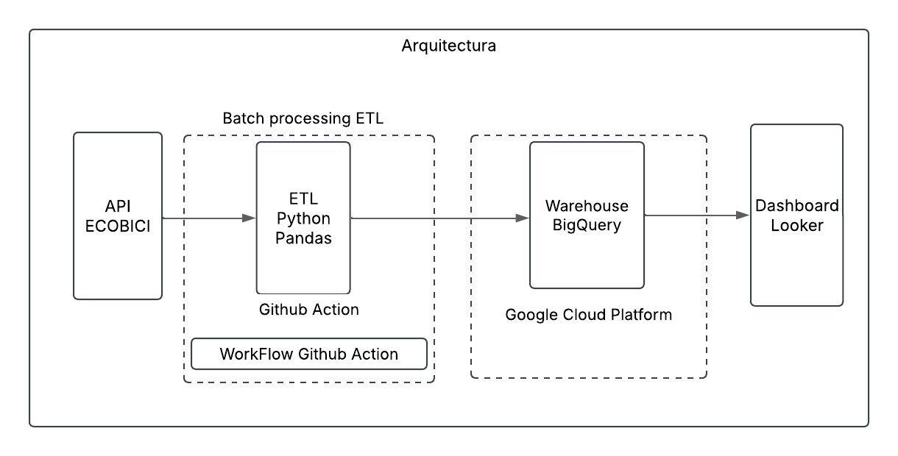

# 🚲Proyecto de automatización ETL del sistema de bicicletas - Ecobici Buenos Aires.

Este proyecto automatiza la extracción, procesamiento y carga de datos del sistema de bicicletas públicas de la Ciudad de Buenos Aires utilizando su API oficial. Los datos son almacenados en Google BigQuery y posteriormente visualizados con Looker Studio. Todo el proceso ETL se ejecuta de forma automática mediante GitHub Actions.

## 🧩 Componentes del Proyecto

- **API Ecobici**: Se consultan dos endpoints de datos abiertos del sistema Ecobici:
  - `stationInformation`: Información estática de las estaciones.
  - `stationStatus`: Información en tiempo real sobre el estado de las estaciones.
- **Google BigQuery**: Los datos procesados se almacenan en tablas del dataset `bici`.
- **GitHub Actions**: Automatiza la ejecución del script de extracción y carga.
- **Looker Studio**: Visualización de los datos mediante dashboards interactivos.

## 🧠 Tecnologías Utilizadas

- Python  
- Pandas  
- Google Cloud BigQuery  
- GitHub Actions  
- Looker Studio

## 🛠️ Arquitectura

## 🔒 Seguridad

- Para la carga de datos necesitarás credenciales para conectarte a BigQuery. No subas el archivo `clave_gcp.json` al repositorio.
- Usa **GitHub Secrets** para guardar `CLIENT_ID` y `CLIENT_SECRET`.

## 📊 Visualización en Looker

Los datos almacenados en **BigQuery** son utilizados como fuente para crear dashboards en **Looker Studio**, facilitando el análisis en tiempo real del sistema de bicicletas.
[El dashboard está en construcción](https://lookerstudio.google.com/)
